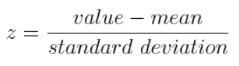
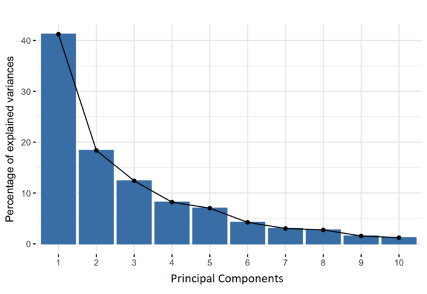

# 💛 UNSUPERVISED LEARNING | Principal Component Analysis ⚖🌲

## Day 19 | Clustering Plant Iris 🙂

### Step 1 :  Find Problem 

- Categorizing Iris Data into 'setosa' 'versicolor' 'virginica'

### Step 2 : Collect Dataset 

- Leaf Iris data analysis and segregate data as different category.
- Import iris dataset from sklearn library
- Input : ```Plant Iris Data```

### Step 3 : Segregate Dataset into X and Y

- Segregation Data
  - X = ```dataset.data```
  - Y = ```dataset.target```
- Summarize data.
  - Shape
  - Describe
  

### Step 3 : Algorithm | Principal Component Analysis


> Definition :

- Dimensionality-reduction method 
- That is often used to reduce the dimensionality of large data sets, 
  - by transforming a large set of variables into a smaller one 
  - that still contains most of the information in the large set.


> Step :

- **Standardization** :
  - All the variables need to be transformed to the same scale.
  - Otherwise, some high input features will contribute lot to output.
  - 
  
  
- **Covariance** :
  - How the variables of the input data are varying from the mean with respect to each other. 
    - Relationship between each other features.
    
  - Conditions :
    - **(+)ve** - Two variables increase or decrease together. ```**Correlated**```
    - **(-)ve** - One increases when the other decreases. ```**Inversely correlated**```
  
- **Eigen Values & Eigen vectors**
  - To find the Principal Components, 
    - Eigen Values & Eigen vectors need to be computed 
      - on the covariance matrix
      
  - Principle Components
    - New variables that are constructed as linear combinations or mixtures of the initial variables.
    - Computing the eigenvectors and ordering them by their eigenvalues in descending order.
    - Eg: 
      - 10-dimensional data gives you 10 principal components, 
      - but PCA tries to put maximum possible information in the first component, 
      - then maximum remaining information in the second and so on.
      - Output: 
      -  
      
    
  - Eigen Vector
    - Directions of the axes where there is the most variance(most information)
    
  - Eigen Values
    - Amount of variance carried in each Principal Component
  
  - **Feature Vector**
    - Where dimension reduction starts.
    - To choose whether to keep all these components or discard those of lesser eigenvalues to form matrix with remaining ones.
      - Feature Vector - Both Eigen vectors
        - 
      - Feature Vector - Only one Eigen vectors
        - 
      
    
  - **Recasting Data along the axes of Principal components**
  - 
  - Reorient the data from the original axes to the ones represented by the principal components.
  - Formula - PCA
    - ```Final Dataset = [Feature Vector]^T * [Standardized Orginal Dataset]^T``` 


## Step 4 : Fitting the PCA clustering to the dataset by specifying the Number of components to keep


## Step 5 : Clustering via the Variance Percentage

> Screenshot for Output of Iris Clustering : 


          
